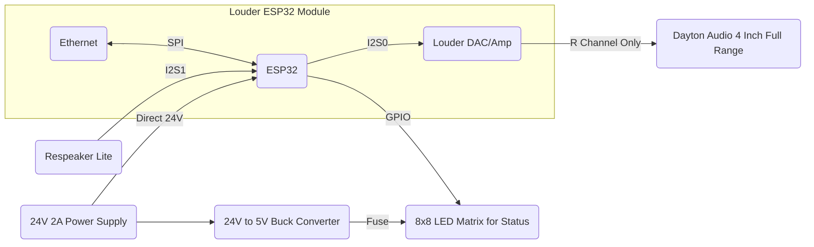

# Implementation

## Hardware Overview
### Component Selection

### Connection Overview

```mermaid
flowchart LR
    subgraph Louder ESP32 Module
        A -- I2S0 --> D
        F <-- SPI --> A
    end
    D -- R Channel Only --> C
    A("ESP32")
    B("Respeaker Lite")
    C("Dayton Audio 4 Inch Full Range")
    D("Louder DAC/Amp")
    E("8x8 LED Matrix for Status")
    F("Ethernet")
    G("24V 2A Power Supply")
    I("24V to 5V Buck Converter")
    G --> I
    I -- Fuse --> E
    G -- Direct 24V --> A
    B -- I2S1 --> A
    A -- GPIO --> E
```

## Firmware Overview
### ESPHome