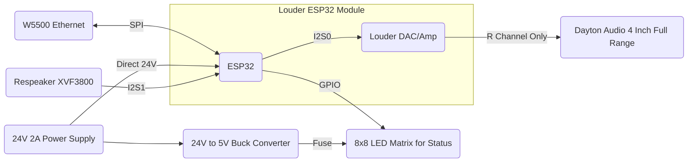

# Implementation

## Hardware Overview
### Component Selection
|  Component | Hardware Used  |    Product Providing Component    |
| ---------- | -------------- | --------------------------------- |
|   Logic    |    ESP32-S3    |      Sonocotta Louder ESP32       |
|    DAC     |    TAS5805M    |      Sonocotta Louder ESP32       |
| Amplifier  |    TAS5805M    |      Sonocotta Louder ESP32       |
|  Ethernet  |      W5500     | Sonocotta Provided Ethernet Addon |
|  Speaker   |  4" Full Range |       Dayton Audio RS100-4        |
| Microphone |     XVF3800    |  Seeed Studio Respeaker XVF3800   |
|    LED     |   WS2812B 8x8  | [BTF-LIGHTING WS2812B RGB 5050SMD](https://www.amazon.com/dp/B01DC0IMRW?ref=ppx_yo2ov_dt_b_fed_asin_title)  |
|   Power    |   24V 2A PSU*  |  Amazon EL Listed Wall Brick**    |
| Power Connection | 5.5 x 2.1mm DC Power Jack Mount | [5.5 x 2.1mm DC Power Jack Threaded Female Panel Mount](https://www.amazon.com/dp/B0D9B7WR23?ref=ppx_yo2ov_dt_b_fed_asin_title&th=1) |
|  5V Down   | Buck Converter |      [DROK Buck Converter](https://www.amazon.com/dp/B01NALDSJ0?ref=ppx_yo2ov_dt_b_fed_asin_title&th=1) |

### Connection Overview

## Firmware Overview
### ESPHome